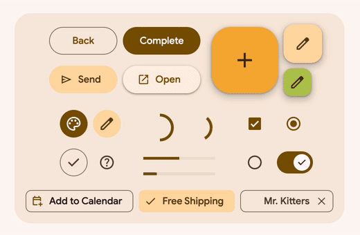

# Material 3 Web Components



[](https://www.jsdelivr.com/package/gh/material-esm/material?tab=stats)

`material` is a library of
[web components](https://developer.mozilla.org/en-US/docs/Web/Web_Components)
that helps build beautiful and accessible web applications. It uses
[Material 3](https://m3.material.io/), the latest version of Google's
open-source design system.

This is a fork of the original [material web](https://github.com/material-components/material-web) project that seems to be on hold.
We are very grateful for the work the team at Google put into the project, but we just can't wait for them to start moving again and we
don't want to stop using these material components we've grown to love.

Please [consider sponsoring](https://github.com/sponsors/treeder) before creating issues for us.

## Demo

[Material 3 Expressive demo](https://material-esm.github.io/material/demo/)

We recommend using this going forward.

To start using it, see [this topic](https://github.com/orgs/material-esm/discussions/71).

## Documentation

All the documentation here still applies: https://material-web.dev/

And we are adding README's in this repository for the new components that aren't in those docs.

## Quick start

### NPM

```sh
npm install material-esm/material
```

### CDN

Add this importmap to the `<head>` section of your app/site:

```html
<script type="importmap">
  {
    "imports": {
      "lit": "https://cdn.jsdelivr.net/npm/lit@3/index.js",
      "lit/": "https://cdn.jsdelivr.net/npm/lit@3/",
      "@lit/localize": "https://cdn.jsdelivr.net/npm/@lit/localize/lit-localize.js",
      "@lit/reactive-element": "https://cdn.jsdelivr.net/npm/@lit/reactive-element@2/reactive-element.js",
      "@lit/reactive-element/": "https://cdn.jsdelivr.net/npm/@lit/reactive-element@2/",
      "lit-element/lit-element.js": "https://cdn.jsdelivr.net/npm/lit-element@4/lit-element.js",
      "lit-html": "https://cdn.jsdelivr.net/npm/lit-html@3/lit-html.js",
      "lit-html/": "https://cdn.jsdelivr.net/npm/lit-html@3/",
      "material/": "https://cdn.jsdelivr.net/gh/material-esm/material@3/"
    }
  }
</script>
```

### Start using the components!

Then you can start using all the components like this:

```html
<script type="module">
  import 'material/text/text-field.js'
  import 'material/buttons/button.js'
</script>

<div>
  <md-text-field color="outlined" label="Name" required minlength="4"></md-text-field>
  <md-button color="filled">Save</md-button>
</div>
```

Or you'll more likely use them within other components, you'd do that like this.

Create a component with the material components in it:

```js
import { html, css, LitElement } from 'lit'
import 'material/text/text-field.js'
import 'material/buttons/button.js'

class DemoComponent extends LitElement {
  static styles = css`
    /* Add your component styles here */
  `

  render() {
    return html`<div style="display: flex; flex-direction: column; gap: 12px;">
      <md-text-field color="outlined" label="Name" required minlength="4"></md-text-field>
      <md-button color="filled" @click=${this.save}>Save</md-button>
    </div>`
  }
  save() {
    console.log('Save button clicked')
  }
}

customElements.define('demo-component', DemoComponent)
```

Then in your HTML:

```html
<script type="module">
  import './components/demo-component.js'
</script>

<demo-component></demo-component>
```

## Color Schemes, Fonts and Typography

In your CSS, set the default font family and sizes, set the following attributes in your CSS:

```css
@import url(light.css) (prefers-color-scheme: light);
@import url(dark.css) (prefers-color-scheme: dark);

:root {
  --md-ref-typeface-brand: 'Google Sans Flex', sans-serif;
  --md-ref-typeface-plain: 'Google Sans Flex', sans-serif;

  font-family: var(--md-ref-typeface-plain);
  font-size: 14px;

  background: var(--md-sys-color-background);
  color: var(--md-sys-color-on-background);
}
```

Be sure to import the fonts you want to use along with Material Symbols:

```html
<link rel="preconnect" href="https://fonts.googleapis.com" />
<link rel="preconnect" href="https://fonts.gstatic.com" crossorigin />
<link
  rel="preload"
  href="https://fonts.googleapis.com/css2?family=Material+Symbols+Outlined:opsz,wght,FILL,GRAD@20..48,100..700,0..1,-50..200&display=swap"
  as="style"
  onload="this.onload=null;this.rel='stylesheet'" />
<link
  rel="preload"
  href="https://fonts.googleapis.com/css2?family=Google+Sans+Flex:wght@400;500;700&display=swap"
  as="style"
  onload="this.onload=null;this.rel='stylesheet'" />
```

To get your dark.css and light.css, go to [Material Theme Builder](https://material-foundation.github.io/material-theme-builder/), pick some colors and export to web/css. Extract the light.css and dark.css from the zip file and place beside your main css file.

## Contributing

We welcome contributions, please discuss and/or make pull requests.

### Demo code

Demo code is here: https://github.com/material-esm/material/tree/main/demo

You can run it locally by checking out this repo and:

```sh
make run
```
